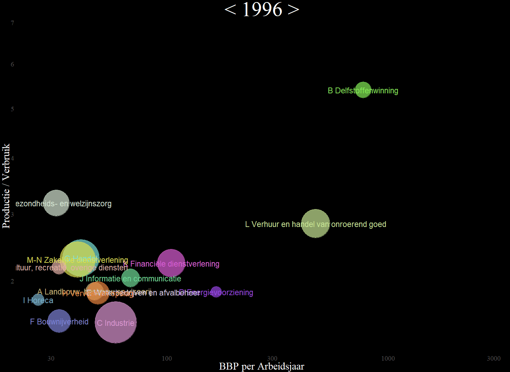

agtnimate
=========

Project om animaties te maken van de Nederlandse economie (nationale rekeningen).

Project to make animations of the Dutch economy (national accounts).

Economie geanimeerd
-------------------

Animatie van de Nederlandse economie, op basis van de aanbod- en gebruiktabel van [de nationale rekeningen](https://www.cbs.nl/nl-nl/economie/macro-economie/wat-zijn-de-nationale-rekeningen-) van het CBS. Zie [Youtube](https://www.youtube.com/watch?v=ze1qyBfhCBQ) voor de uiteindelijke animatie.

Het onderscheid naar bedrijfsklassen in de aanbod- en gebruiktabel geeft inzicht in de structuur van de economie. Hoe groot zijn bepaalde bedrijfsklassen? Hoe hebben deze zich ontwikkeld in de tijd? Hoe verhoudt een bestedingscategorie zich tot de hele economie? Welke dynamiek is er in de economie? Hoe liggen de verhoudingen per bedrijfsklasse rondom productie en verbruik? Waar en hoe wordt verdiend in de economie? De aanbod- en gebruiktabel kan deze vragen over de omvang, samenstelling en ontwikkeling van de economie en haar onderdelen beantwoorden...

Voorbeeld van animatie in de film, geinspireerd door Gapminder:

